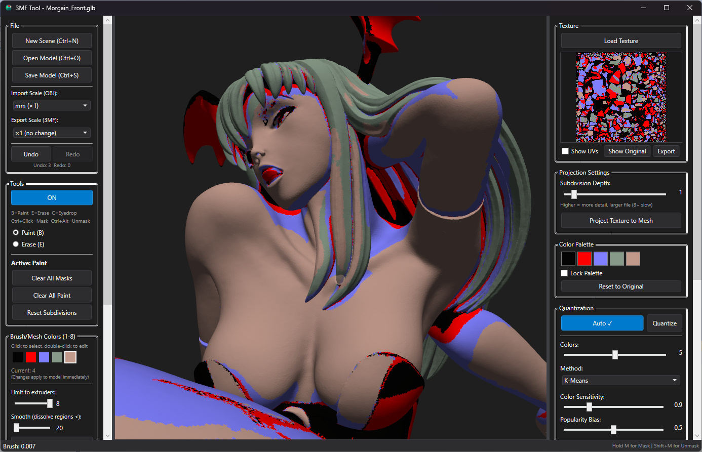

# 3MFTool: Multi-Extruder 3D Texturing Suite

A Windows application for painting multi-material textures onto 3D models and exporting them as PrusaSlicer/OrcaSlicer compatible 3MF files.


-lightgrey.svg)



## Features

- **Load 3D Models** - Import OBJ and 3MF files with UV coordinates
- **Texture Projection** - Project textures onto mesh using UV mapping
- **Color Quantization** - Reduce textures to 2-8 colors using multiple algorithms (Uniform, K-Means, Median Cut, Octree)
- **Interactive Painting** - Paint directly on the 3D model with adjustable brush size
- **Multi-Material Export** - Save as 3MF with `slic3rpe:mmu_segmentation` data compatible with PrusaSlicer and OrcaSlicer
- **Undo/Redo** - Full stroke-based undo history

## Screenshots

*Coming soon*

## Requirements

- Windows 10/11
- .NET 8.0 Runtime
- OpenGL 3.3+ compatible graphics

## Quick Start

1. **Load a model** - File → Open (Ctrl+O) - supports OBJ and 3MF
2. **Load a texture** - Click "Load Texture" in the Texture panel
3. **Quantize** - Select number of colors and method, click "Quantize Texture"
4. **Project** - Set subdivision level (4-6 recommended), click "Project to Mesh"
5. **Paint** - Use left mouse button to paint, adjust colors with number keys 1-8
6. **Save** - File → Save (Ctrl+S) as 3MF

## Controls

| Input | Action |
|-------|--------|
| Left Mouse | Paint |
| Right Mouse | Orbit camera |
| Middle Mouse | Pan camera |
| Scroll | Zoom |
| Alt + Scroll | Resize brush |
| 1-8 | Select color |
| Tab / Shift+Tab | Cycle colors |
| B | Paint tool |
| E | Erase tool |
| I | Eyedropper |
| M (hold) | Mask tool |
| [ / ] | Decrease/Increase brush size |
| Ctrl+Z | Undo |
| Ctrl+Y | Redo |
| F | Frame model |
| R | Reset view |

## Technical Details

This tool generates MMU (Multi-Material Unit) segmentation data compatible with PrusaSlicer's painting format. Each triangle can be subdivided into a quadtree structure where leaf nodes store color indices.

See the [Wiki](wiki/MMU-Segmentation-Format.md) for detailed technical documentation on the encoding format.

## Building

```bash
git clone https://github.com/yourusername/3MFTool.git
cd 3MFTool
dotnet build
```

## Dependencies

- [OpenTK 4.8.2](https://github.com/opentk/opentk) - OpenGL bindings
- [System.IO.Compression](https://www.nuget.org/packages/System.IO.Compression) - ZIP/3MF handling

## License

MIT License - See [LICENSE](LICENSE) for details.

## Acknowledgments

- PrusaSlicer team for the MMU segmentation format
- OpenTK contributors for the excellent OpenGL wrapper
